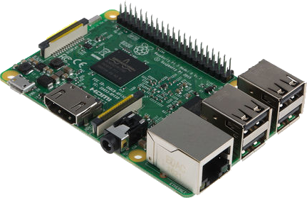

### Titre de niveau 3

Si vous avez des [questions techniques][1] ou avez besoin d'aide, consultez la [documentation][1] de MoodleBox.

L'opération décrite ci-dessous n'est pas requise si vous avez téléchargé l'image-disque sur ce site web. Toutefois, il peut être nécessaire de l'exécuter si vous avez reçu une image-disque personnalisée.

### Encore un titre de niveau 3

- Une liste dans une notice ;
- [Copier votre image-disque personnalisée][2] sur la carte microSD ;
- [démarrez votre MoodleBox][3] de la manière habituelle ;
- [connectez-vous au Moodle][4] de la MoodleBox en utilisant un compte administrateur. Si les comptes utilisateurs de la MoodleBox n'ont pas été modifiés, utilisez les [informations de connexion par défaut][5].

Si vous avez d'autres questions ou des commentaires sur ce site, voulez partager votre expérience avec la MoodleBox, désirez contribuer au projet, en traduisant ce site ou en améliorant son design, veuillez remplir le formulaire ci-contre. Nous nous ferons un plaisir de vous contacter.

 [1]: 
 [2]: https://moodlebox.net
 [3]: https://moodlebox.net
 [4]: https://moodlebox.net
 [5]: https://moodlebox.net
