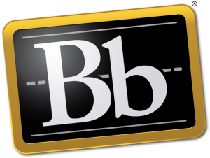

[Blackboard][1] a annoncé hier avoir [racheté deux partenaires][2] [Moodle][3] et [engagé][4] à une position dirigeante un des fondateurs du projet [Sakai][5]. En même temps, Blackboard a communiqué l'ouverture d'une nouvelle branche de son modèle commercial, les _[Blackboard Education Open Source Services][6]_, pour proposer des prestations de support aux utilisateurs de Moodle et de Sakai, par exemple de l'hébergement, du développement, de la formation, etc.



<!-- [] -->
Ces trois annonces simultanées semblent une anticipation sur le 1er avril, au regard de l'histoire récente et des vaines attaques de Blackboard contre les projets de plateformes e-learning libres (voir l'affaire du brevet sur le e-learning).

Qu'est-ce qui se cache derrière ce changement radical de stratégie, qui va plutôt dans le sens d'une diminution de la part de marché de son environnement d'apprentissage maison ? Quelles sont les véritables intentions de Blackboard, ou, pour le dire autrement, quels bénéfices compte y trouver l'entreprise de Washington ?

La réponse à cette question est très difficile, et l'on ne peut faire que des conjectures.Une raison possible évoquée serait de faire du tort à Moodle, en sapant son modèle économique de l'intérieur. Une piste plus vraisemblable est peut-être donnée par ce bref extrait de la [lettre ouverte à la communauté][8] publiée par Bb :

> [&hellip;] we're looking at the entire student lifecycle within the education institutions we serve.

### Pas les produits, mais les données !

Comme le suggère [Marc Aberdour][9], Blackboard connaît le potentiel commercial des données. Et il s'agit ici d'un gigantesque marché, estimé à [100 milliards de dollars][10] (vous avez bien lu) et en croissance constante de 10% par année.

En exploitant les informations livrées par le plus grand nombre de systèmes e-learning possible, une entreprise pourra faire énormément d'argent en monétisant les données (personnelles ou non) de nos élèves ou étudiants. Dans ce modèle, l'utilisateur final d'un service n'est plus le client, mais bien le produit. C'est le modèle commercial actuel de [Google][11] et de [Facebook][12] (vous croyiez vraiment que leurs outils vous sont offerts sans contrepartie ?). Il est vraisemblable que c'est sur ce terrain que s'aventure désormais Blackboard.

La protection des données de nos enfants est de ce fait dans l'Œil du cyclone et il est de notre devoir d'être très vigilant.

 [1]: https://www.blackboard.com/
 [2]: http://pages.blackboard.com/news-and-events/press-releases.aspx?releaseid=1676738
 [3]: https://moodle.org/ "Moodle"
 [4]: http://pages.blackboard.com/news-and-events/press-releases.aspx?releaseid=1676736
 [5]: https://sakaiproject.org/
 [6]: https://www.blackboard.com/services/blackboard-education-open-source-services.aspx
 [8]: http://pages.blackboard.com/news-and-events/press-releases/2012/blackboard-launches-open-source-services-group.aspx
 [9]: http://www.open-thoughts.com/2012/03/blackboard-to-offer-moodle-and-sakai-services-in-the-race-for-student-data/
 [10]: https://www.economist.com/special-report/2010/02/25/data-data-everywhere
 [11]: https://google.com/
 [12]: https://www.facebook.com/

<!--more-->
