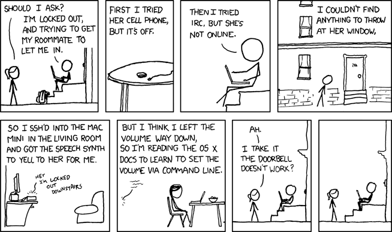

Le site [XKCD][1] regorge d'authentiques perles d'humour absurde sur la condition des [geeks][2] (on prononce « guik »), ces fanatiques de l'informatique enfermés dans leur univers. En voici deux excellents échantillons.

#### Flowchart

[][3]

#### I'm an idiot

[][4]

 [1]: https://xkcd.com/
 [2]: https://fr.wikipedia.org/wiki/Geek
 [3]: https://xkcd.com/518/
 [4]: https://xkcd.com/530/

<!--more-->
