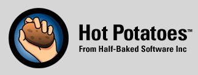

<!--

 -->

La société Half-Baked Software annonce sur [son site web][1] que le logiciel [Hot Potatoes][2], dont elle vendant les licences, est désormais gratuit et qu'elle ne fournit plus d'assistance à son sujet. Hot Potatoes est très utilisé dans les milieux de l'éducation pour fabriquer des tests (quiz) accessibles sur le web. De tels tests peuvent être intégrés à Moodle.

Le logiciel en version complète est téléchargeable sur le site web de Hot Potatoes, hébergé à l'[Université de Victoria][3], au Canada.

Malheureusement, aucune information n'est disponible sur la licence sous laquelle Hot Potatoes est publié gratuitement. Deviendra-t-il un logiciel libre ou restera-t-il dans un modèle de code source fermé ?

 [1]: http://www.halfbakedsoftware.com/
 [2]: http://hotpot.uvic.ca/
 [3]: http://hcmc.uvic.ca/

<!--more-->
