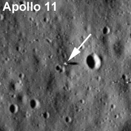

À l'approche du [40e anniversaire du premier pas de l'Homme sur la Lune][1], ressortent les habituelles théories de la conspiration, mettant en doute la véracité des visites humaines sur [notre satellite][2].

Une des objections fréquemment avancées par les adeptes de ces théories réside dans le fait que si les alunissages étaient réels, on nous aurait montré des photographies des différents vaisseaux sur la Lune, prises avec nos télescopes les plus performants, par exemple [Hubble][3] et les télescopes du [VLT][4].



<!--
<figure id="attachment_178" style="width: 256px" class="wp-caption alignright"><figcaption class="wp-caption-text">Photo de Apollo 11 depuis LRO, juillet 2009</figcaption></figure>
 -->

La raison en est pourtant simple : aucun des télescopes actuels, aussi puissant soit-il, n'est capable de distinguer des objets de la taille du [LEM][6] sur la Lune. En effet, la résolution de Hubble est entre 0.03 et 0.06 secondes d'arc, suivant la longueur d'onde dans la lumière visible, et celle d'[un télescope du VLT][7] d'environ 0.02 secondes d'arc, en utilisant l'optique adaptative (qui permet de s'affranchir des problèmes de visibilité dus à l'atmosphère). Or un objet de 5 mètres de diamètre, comme la base du LEM sur la Lune, a depuis la Terre une dimension angulaire d'environ 0.003 secondes d'arc, et il faudrait donc un télescope beaucoup plus grand (environ 120 m de diamètre) pour le voir.

Mais il y a du neuf : le [LRO][8] ou Lunar Reconnaissance Orbiter de la [NASA][9] a pris du 11 au 15 juillet 2009 des [photos des sites][10] Apollo. On peut y voir pour la première fois les structures matérielles des [missions Apollo][11]. Ces photos ont été prises avant même que LRO atteigne son altitude optimale pour les prises. On s'attend donc à de bien meilleures photographies encore.

 [1]: http://www.nasa.gov/mission_pages/apollo/40th/index.html
 [2]: https://apod.nasa.gov/apod/ap051113.html
 [3]: http://www.stsci.edu/hst/
 [4]: http://www.eso.org/projects/vlt/
 [5]: http://www.nasa.gov/images/content/369440main_lroc_apollo11_lrg.jpg
 [6]: https://fr.wikipedia.org/wiki/Module_lunaire
 [7]: https://fr.wikipedia.org/wiki/Very_Large_Telescope
 [8]: https://www.nasa.gov/mission_pages/LRO/main/index.html
 [9]: https://www.nasa.gov/index.html
 [10]: https://www.nasa.gov/mission_pages/LRO/multimedia/lroimages/apollosites.html
 [11]: https://fr.wikipedia.org/wiki/Programme_Apollo

<!--more-->
