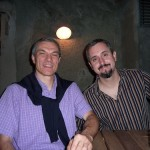
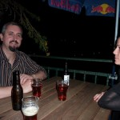

Pour la dernière étape de son tour du monde, et après une conférence donnée au [CERN][1] à Genève, le créateur et développeur principal de [Moodle][2], [Martin][3] [Dougiamas][4], était hier et aujourd'hui de passage à [Fribourg][5]. Ses précédentes étapes l'avaient conduit aux États-Unis, où il a participé à deux [MoodleMoots][6], à [Goshen][7] (Indiana) et [Austin][8] (Texas).

J'ai eu la chance de passer une excellente soirée avec lui, en compagnie de [Penny Leach][9], développeuse active de Moodle et de [Mahara][10].





<!--

  <figure class="gallery-item">

  

    
  
<figcaption class="gallery-caption" id="caption639">

  Martin Dougiamas et Nicolas Martignoni  </figcaption></figure><figure class="gallery-item">

  

    
  
<figcaption class="gallery-caption" id="caption640">

  Martin Dougiamas et Penny Leach sur la terrasse du Belvédère  </figcaption></figure>

 -->

 [1]: https://home.cern
 [2]: https://moodle.org/
 [3]: https://en.wikipedia.org/wiki/Martin_Dougiamas
 [4]: https://dougiamas.com/
 [5]: https://www.fribourgtourisme.ch/
 [6]: https://moodlemoot.org
 [7]: https://www.goshen.edu/moodle/
 [8]: https://www.moot-us.com/austin/
 [9]: http://she.geek.nz/
 [10]: https://mahara.org/

 <!--more-->
