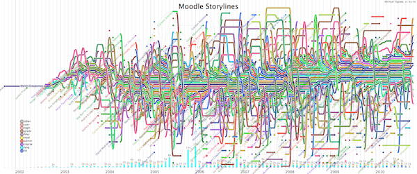

La représentation graphique d'un scénario est chose difficile. [XKCD][1] a [tenté l'expérience][2] de façon convaincante notamment pour le _Seigneur des Anneaux_ et la _Guerre des Étoiles_. [Michael Ogawa][3] a transposé cette représentation pour visualiser l'évolution du développement de logiciels, de façon à conserver une continuité et un persistance des données. Le [code source prototype][4] de ce projet, _evoline_, est libre. Cette représentation montre une synthès sur la durée, contrairement à [code_swarm][5], que j'ai utilisée dans un [précédent article][6], ou à [gource][7], récemment employé par [David Mudrak][8] pour montrer l'[évolution de Moodle][9].



<!--
[][10]
 -->

Les données proviennent du dépôt du code source de Moodle. Le temps est représenté sur l'axe horizontal, et s'écoule de gauche à droite. Les développeurs sont groupés chaque mois en fonction des modifications qu'ils font sur le code source. Au bas de l'illustration, un histogramme montre le volume et le type des fichiers modifiés. En glissant le pointeur sur une ligne, celle-ci est mise en évidence pour mieux suivre le parcours d'un développeur.

L'illustration ci-dessus sert de lien vers un fichier SVG interactif. La plupart des navigateurs modernes sont capables d'afficher ce format. Seul [IE n'en est pas capable][11] actuellement.

 [1]: https://xkcd.com/
 [2]: https://xkcd.com/657/
 [3]: http://www.michaelogawa.com/
 [4]: https://github.com/martignoni/evolines
 [5]: http://www.michaelogawa.com/code_swarm/
 [6]: 
 [7]: https://github.com/acaudwell/Gource
 [8]: http://blog.mudrak.name/
 [9]: https://www.youtube.com/watch?v=Ut5JoqIaUHs
 [10]: moodle.svg
 [11]: https://fr.wikipedia.org/wiki/Scalable_Vector_Graphics#Les_navigateurs_SVG

 <!--more-->
