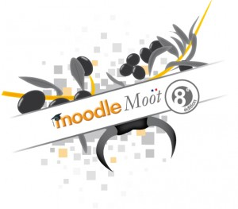



<!--
[][1]À vos plumes et claviers !
 -->

Les propositions de communications pour l'[édition 2012 du MoodleMoot][1] sont attendues avant le 19 mars 2012.

Les retours d'expériences pédagogiques utilisant Moodle ou Mahara sont les bienvenues !

 [1]: http://moodlemoot2012.unimes.fr/ "MoodleMoot 2012"

<!--more-->
