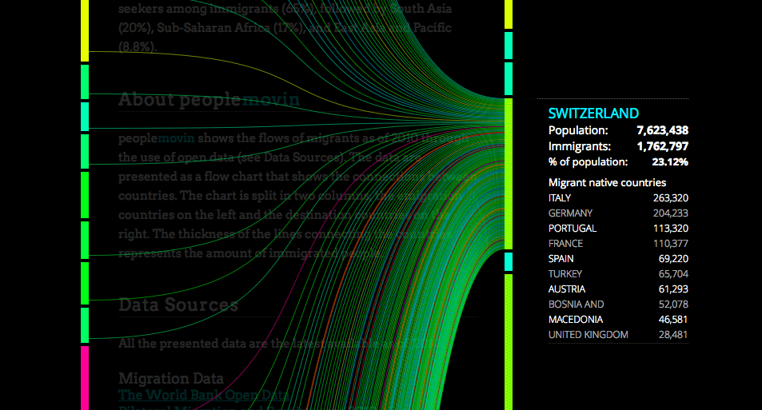
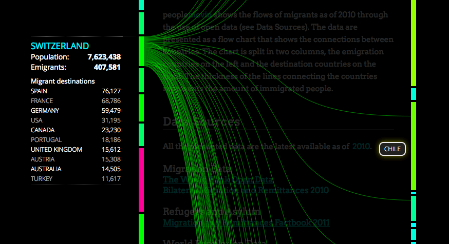

Le site [peoplemovin][1] de [Carlo Zapponi][2] présente de manière originale les migrations de population entre états. Voici par exemple la représentation de l'immigration en Suisse.



<!--
[][3]
 -->

Et ci-dessous l'émigration depuis la Suisse.



<!--
[][4]
 -->

Les données datent de 2010. La visualisation est publiée en HTML5 au moyen d'un outil appelé datamovin, qui sera publié prochainement.

_<small>Via [Flowingdata][5].</small>_

 [1]: http://peoplemov.in/
 [2]: https://twitter.com/littleark
 [3]: Immigration-ch.png
 [4]: emigration-ch.png
 [5]: https://flowingdata.com/2011/08/10/people-moving/ "Flowingdata"

<!--more-->
